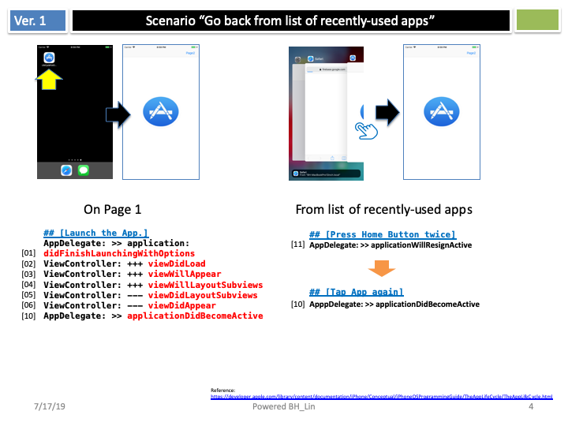
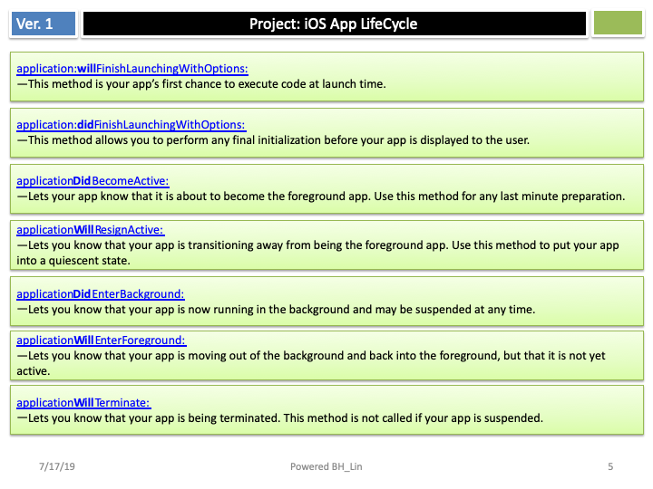

# iOS App Life Cycle Demo

A comprehensive demonstration of iOS Application and View Controller lifecycle methods, showing the order in which they are called through console logging.

## Overview

This project provides a practical example of how iOS app lifecycle works by implementing and logging all major lifecycle methods in both `AppDelegate` and `ViewController`. Each method includes numbered console output to clearly show the execution sequence.

## Features

- **Complete AppDelegate Lifecycle**: Demonstrates all major application state transitions
- **Full ViewController Lifecycle**: Shows view controller state changes from loading to disappearing
- **Sequential Logging**: Each method includes numbered output to track execution order
- **Educational Documentation**: Includes slide images explaining the lifecycle concepts

## Lifecycle Methods Demonstrated

### AppDelegate Methods
1. `application:didFinishLaunchingWithOptions` - App launch completion
2. `applicationWillResignActive` - App becoming inactive
3. `applicationDidEnterBackground` - App entering background
4. `applicationWillEnterForeground` - App returning to foreground
5. `applicationDidBecomeActive` - App becoming active
6. `applicationWillTerminate` - App termination
7. `applicationDidReceiveMemoryWarning` - Memory pressure handling

### ViewController Methods
1. `viewDidLoad` - View loaded into memory
2. `viewWillAppear` - View about to appear
3. `viewWillLayoutSubviews` - Auto Layout about to run
4. `viewDidLayoutSubviews` - Auto Layout completed
5. `viewDidAppear` - View appeared and is visible
6. `viewWillDisappear` - View about to disappear
7. `viewDidDisappear` - View disappeared
8. `viewWillTransition` - Size transition handling

## How to Use

1. **Clone the Repository**
   ```bash
   git clone https://github.com/yourusername/iOS_App_Life_Cycle.git
   cd iOS_App_Life_Cycle
   ```

2. **Open in Xcode**
   ```bash
   open LifeCycleForiOSApp/LifeCycleForiOSApp.xcodeproj
   ```

3. **Run the App**
   - Select a simulator or device
   - Press `Cmd+R` to build and run
   - Watch the console output in Xcode's debug area

4. **Test Different Scenarios**
   - **App Launch**: See methods [01] through [06] execute
   - **Home Button**: Press home to see background transition methods [11], [12]
   - **Return to App**: Tap app icon to see foreground methods [07], [10]
   - **Rotation**: Rotate device to see transition methods
   - **Memory Warning**: Simulate memory warning in simulator

## Console Output Example

When you run the app, you'll see output like:
```
AppDelegate: >> [01]. application: didFinishLaunchingWithOptions
ViewController: [02]. +++ viewDidLoad
ViewController: [03]. +++ viewWillAppear
ViewController: [04]. +++ viewWillLayoutSubviews
ViewController: [05]. --- viewDidLayoutSubviews
ViewController: [06]. --- viewDidAppear
AppDelegate: >> [10]. applicationDidBecomeActive
```

## Educational Content

The project includes educational slides that explain:





## Requirements

- **iOS**: 11.0+
- **Xcode**: 12.0+
- **Swift**: 5.0+

## Key Learning Points

- **App States**: Understanding Active, Inactive, Background, and Suspended states
- **Method Order**: The specific sequence in which lifecycle methods are called
- **State Transitions**: How apps move between different states
- **Memory Management**: When and how to handle memory warnings
- **UI Updates**: Appropriate places to update user interface elements

## Project Structure

```
iOS_App_Life_Cycle/
├── LifeCycleForiOSApp/
│   ├── LifeCycleForiOSApp/
│   │   ├── AppDelegate.swift      # App lifecycle implementation
│   │   ├── ViewController.swift   # View controller lifecycle
│   │   └── Assets.xcassets/       # App icons and images
│   └── LifeCycleForiOSApp.xcodeproj/
├── images/                        # Educational slides
└── README.md
```

---
